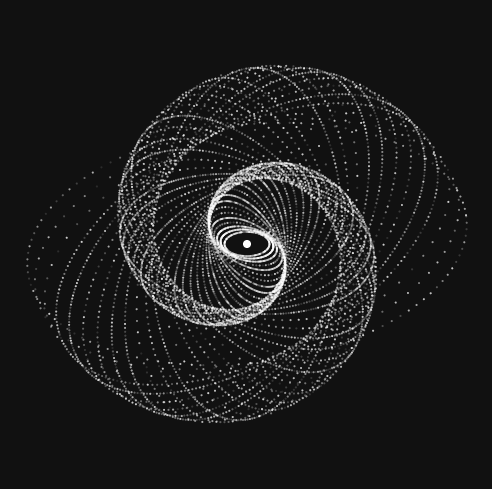

# Galaxy Map

Experimental code toward drawing a galactic map in React + Atom-Shell. That's not what it does right now, but it does draw some cool stuff.



## Running

```
./run.sh
```

## Hacking

You'll need to `npm install` to get things started, plus foreman, jsx, saas. This is not a clean dev environment.

```
foreman start
```
